# ETL Pipeline Architecture

This document provides visual architecture diagrams for the Salesforce to Supabase ETL pipeline, designed for executive and technical presentations.

---

## Executive Summary Diagram


**Key Benefits:**
- 🚀 **Automated**: Daily processing via email webhook (eliminates manual work)
- ✅ **Reliable**: Quality validation prevents bad data from entering warehouse
- ⚡ **Fast**: Bulk PostgreSQL COPY loads 600K+ rows in seconds
- 🛡️ **Safe**: Quarantine system isolates failures without blocking good data

---

## Detailed Technical Architecture

```mermaid
flowchart TB
    subgraph "External Systems"
        SF[Salesforce<br/>Daily CSV Exports]
        CloudMailin[CloudMailin Service<br/>Email-to-Webhook]
    end
    
    subgraph "Entry Layer"
        Webhook["/webhook/cloudmailin<br/>Token Auth + HTTPS"]
        Upload["/upload<br/>Web Interface<br/>100 MB Limit"]
    end
    
    subgraph "Flask Application Layer"
        direction TB
        Router[Flask Router<br/>main.py]
        Progress[Real-time Progress<br/>AJAX Polling]
    end
    
    subgraph "ETL Core Modules"
        direction TB
        Mapper[Mapping Parser<br/>etl/mapper.py<br/>YAML Rules]
        Validator[QA Validator<br/>etl/validator.py<br/>Header/Duplicate Check]
        Transformer[Data Transformer<br/>etl/transformer.py<br/>Column Rename/Coerce]
        Loader[Bulk Loader<br/>etl/loader.py<br/>PostgreSQL COPY<br/>UPSERT/INSERT Strategy]
        Notifier[Notification Service<br/>etl/notifications.py<br/>Success/Failure Alerts]
    end
    
    subgraph "Data Storage"
        direction LR
        Staging[(Staging Tables<br/>contacts<br/>job_applicant<br/>form_submission<br/>jobs_and_placements<br/>contacts_with_jobs<br/>job_applicant_history<br/>placement_history)]
        
        Metadata[(Metadata Tables<br/>load_history<br/>webhook_log)]
        
        Quarantine[("Quarantine Storage<br/>quarantine/<br/>Failed Files")]
    end
    
    subgraph "Observability & Consumption"
        direction TB
        Dashboards[Web Dashboards<br/>• Load History<br/>• Webhook Activity<br/>• Real-time Progress]
        Analytics[Analytics & BI<br/>• Tableau/PowerBI<br/>• SQL Queries<br/>• Business Reports]
    end
    
    subgraph "Configuration"
        YAML[YAML Mappings<br/>Mappings/*.yaml<br/>Field Rules<br/>Natural Keys<br/>Transformations]
    end
    
    SF --> CloudMailin
    CloudMailin --> Webhook
    SF -.Manual.-> Upload
    
    Webhook --> Router
    Upload --> Router
    
    Router --> Progress
    Router --> Mapper
    
    YAML --> Mapper
    Mapper --> Validator
    
    Validator -->|Pass| Transformer
    Validator -->|Fail| Quarantine
    
    Transformer --> Loader
    
    Loader -->|UPSERT Mode<br/>Natural Key Match| Staging
    Loader -->|INSERT Mode<br/>History Tables| Staging
    
    Loader --> Metadata
    Loader --> Notifier
    Validator --> Metadata
    Quarantine --> Notifier
    
    Progress -.Polls Status.-> Metadata
    
    Metadata --> Dashboards
    Staging --> Analytics
    
    style SF fill:#e1f5ff
    style CloudMailin fill:#e1f5ff
    style Webhook fill:#b8e6b8
    style Upload fill:#fff4b8
    style Router fill:#ffd4b8
    style Mapper fill:#ffd4b8
    style Validator fill:#ffd4b8
    style Transformer fill:#ffd4b8
    style Loader fill:#ffd4b8
    style Notifier fill:#ffffcc
    style Staging fill:#d4b8ff
    style Metadata fill:#e8e8e8
    style Quarantine fill:#ffb8b8
    style Dashboards fill:#e8e8e8
    style Analytics fill:#c8e6c9
    style YAML fill:#ffffcc
    style Progress fill:#b8e6b8
```



---

## Data Flow Sequence Diagram

```mermaid
sequenceDiagram
    participant SF as Salesforce
    participant CM as CloudMailin
    participant Flask as Flask App
    participant Val as Validator
    participant Trans as Transformer
    participant Load as Loader
    participant DB as PostgreSQL
    participant Notify as Notifications
    participant Q as Quarantine
    
    SF->>CM: Daily CSV Export (6 AM)
    CM->>Flask: POST /webhook/cloudmailin
    activate Flask
    
    Flask->>Flask: Verify Token Auth
    Flask->>Flask: Auto-detect YAML Mapping (from filename)
    Flask->>DB: Create load_history Record
    
    Flask->>Val: Validate CSV
    activate Val
    
    Val->>Val: Check Headers
    Val->>Val: Detect Duplicates
    Val->>Val: Verify Required Fields
    
    alt Validation Passes
        Val-->>Flask: ✓ Valid
        deactivate Val
        
        Flask->>Trans: Transform Data
        activate Trans
        Trans->>Trans: Apply YAML Rules
        Trans->>Trans: Rename Headers
        Trans->>Trans: Coerce Types
        Trans-->>Flask: Transformed CSV
        deactivate Trans
        
        Flask->>Load: Bulk Load
        activate Load
        
        alt UPSERT Mode (Natural Key)
            Load->>DB: CREATE TEMP TABLE
            Load->>DB: COPY to Temp
            Load->>DB: DELETE Old Records
            Load->>DB: INSERT New Records
        else INSERT Mode (History)
            Load->>DB: COPY Direct Insert
        end
        
        Load-->>Flask: Success (Row Count)
        deactivate Load
        
        Flask->>DB: Update load_history (success)
        Flask->>Notify: Log Success (file, rows, table)
        Flask-->>CM: 200 OK
        
    else Validation Fails
        Val-->>Flask: ✗ Errors
        deactivate Val
        Flask->>Q: Move to Quarantine
        Flask->>DB: Update load_history (failed)
        Flask->>Notify: Log Failure (file, errors, quarantine path)
        Flask-->>CM: 200 OK (quarantined)
    end
    
    deactivate Flask
```

---

## Security Architecture


---

## Load Strategy: UPSERT vs INSERT Mode


---

## System Components Overview

### Entry Points
- **CloudMailin Webhook**: Automated daily processing via email (6 AM scheduled)
- **Web Upload Interface**: Manual uploads and historical backfills

### ETL Pipeline Modules
- **Mapping Parser** (`etl/mapper.py`): Loads YAML transformation rules
- **QA Validator** (`etl/validator.py`): Header, duplicate, and required field validation
- **Data Transformer** (`etl/transformer.py`): Column renaming and type coercion
- **Bulk Loader** (`etl/loader.py`): High-performance PostgreSQL COPY operations

### Data Storage
- **7 Staging Tables**: Salesforce data optimized for analytics
- **Metadata Tables**: `load_history` (ETL runs), `webhook_log` (automation tracking)
- **Quarantine System**: Failed file isolation with error logging

### Configuration
- **YAML Mappings** (`Mappings/*.yaml`): Define field transformations, natural keys, and load strategies
- **Environment Variables**: Database connections, webhook tokens

### Monitoring
- **Real-time Progress Tracking**: AJAX polling with visual progress bar
- **Load History Dashboard**: Success/failure tracking with row counts and timing
- **Webhook Activity Log**: Email processing monitoring

---

## Performance Characteristics

| Metric | Value |
|--------|-------|
| **Bulk Load Speed** | 600K+ rows in seconds (PostgreSQL COPY) |
| **Validation Performance** | Single-pass algorithm, 50K row progress updates |
| **File Size Limit** | 100 MB per upload |
| **Encoding Support** | UTF-8, Windows-1252, ISO-8859-1 (graceful handling) |
| **UPSERT Strategy** | Temp table approach (no schema locks) |
| **Concurrency** | Connection retry logic with keep-alive |

---

## Error Handling & Resilience


---

## Deployment Architecture


---

## Usage Instructions

### For Presentations

1. **Executive Summary Diagram**: Perfect for CEO/CFO - shows business value and automation
2. **Detailed Technical Architecture**: For CTO - shows all components and data flow
3. **Security Architecture**: Highlights protection mechanisms
4. **Load Strategy Diagram**: Explains UPSERT vs INSERT logic

### Viewing Options

- **GitHub/Markdown Viewers**: Diagrams render automatically
- **Mermaid Live Editor**: Copy/paste into https://mermaid.live for editing
- **Export as Images**: Use Mermaid Live Editor to export PNG/SVG for PowerPoint
- **Documentation**: Embed in Confluence, Notion, or other docs platforms

### Customization

Edit the Mermaid code blocks to:
- Adjust colors (e.g., `fill:#color`)
- Add/remove components
- Change layout direction (`TB` = top-to-bottom, `LR` = left-to-right)
- Modify text and labels
